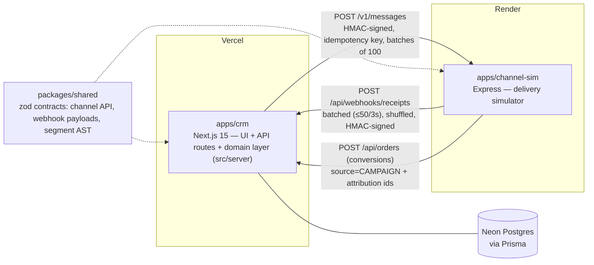
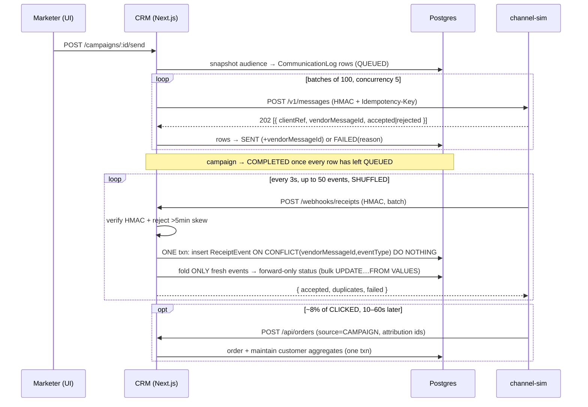

# Architecture

Resonate is two deployable services plus a shared contract package, over Postgres.

## System

## Send → receipt → fold (the heart)

## Why this survives a hostile receipt stream

- **Contract-first** — both services validate every boundary with the *same* zod schemas from `packages/shared`. Drift fails loudly on whichever side is wrong.
- **Idempotent ingestion** — the append-only `ReceiptEvent` ledger has a unique `(vendorMessageId, eventType)` constraint. Replaying a whole batch inserts zero new rows, so it produces zero duplicate state changes.
- **Forward-only state machine** — `QUEUED(0) < SENT(1) < DELIVERED(2) < READ(3) < CLICKED(4)`; `FAILED` is terminal and only reachable from QUEUED/SENT. A CLICKED that arrives before DELIVERED still lands at CLICKED with both timestamps set — order-independent by construction.
- **Crash-safe send** — a batch that can't reach the sim (after one retry) marks its rows `FAILED("channel_unreachable")` and the run continues; the campaign always settles, never leaving zombies in QUEUED.
- **AI fails safe** — `generateObject` fills a bounded schema, then the canonical zod whitelist (segment fields / merge fields) re-validates it; one retry-with-error, then a graceful fallback. A hallucinated field is structurally impossible.
- **One domain layer, thin routes** — API handlers parse/validate and delegate to `apps/crm/src/server/*`; the same functions would back the optional AI copilot (one domain, two consumers).

See [`decisions.md`](decisions.md) for the at-scale evolution of each of these.
